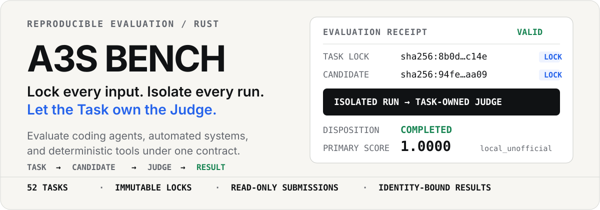
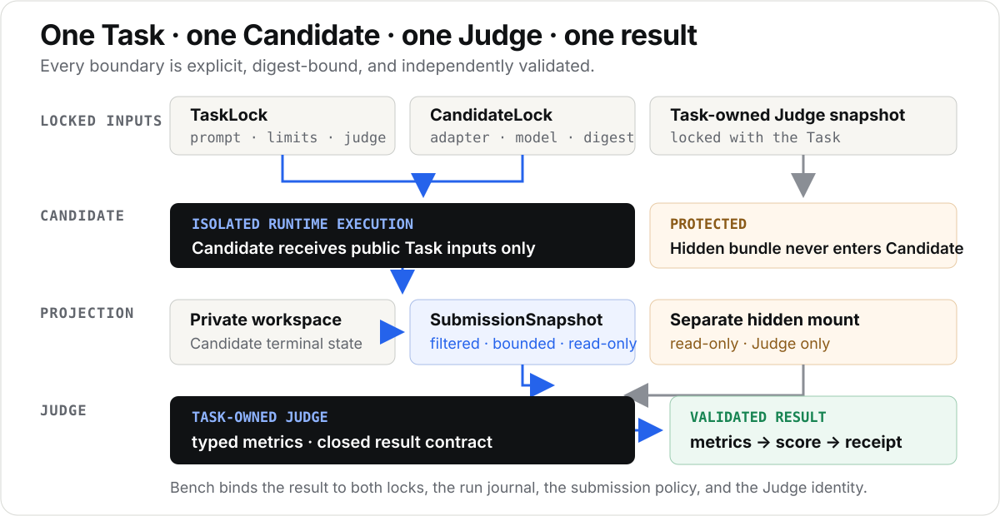

<p align="center">
  
</p>

<p align="center">
  <strong>Language / 语言:</strong>
  <a href="README.md">English</a> ·
  <a href="README.zh-CN.md">中文</a>
</p>

<p align="center">
  <strong>面向编码 Agent 与自动化系统的可复现评测。</strong>
</p>

<p align="center">
  <a href="https://github.com/A3S-Lab/Bench/actions/workflows/ci.yml"></a>
  <a href="https://github.com/A3S-Lab/Bench/releases/latest"></a>
  <a href="https://www.rust-lang.org/"></a>
  <a href="https://opensource.org/license/mit"></a>
</p>

<p align="center">
  <a href="#run-one-complete-evaluation">快速开始</a> ·
  <a href="#the-evaluation-contract">评测契约</a> ·
  <a href="#candidates">Candidates</a> ·
  <a href="#runtime-providers">Runtimes</a> ·
  <a href="#authoring">编写</a> ·
  <a href="#development">开发</a>
</p>

---

A3S Bench 是 A3S 的评测控制组件。它将 Task 与 Candidate 捕获为不可变锁，在隔离的 Runtime 中执行 Candidate，投影有界的只读提交，调用由 Task 拥有的 Judge，校验其指标，并存储与身份绑定的结果。

Candidate 可以是 Agent、其他自动化系统，或确定性工具。Bench 刻意**不是** Agent Runtime，也不是排行榜：Runtime 拥有执行，Task 拥有其 Judge，本地结果保持 `local_unofficial`。

## 运行一次完整评测

`quick_file_edit` 一致性 Task 在数秒内演练锁定、Candidate 执行、提交投影、评判与结果持久化。

要求：

- 最新的 [`a3s` CLI](https://github.com/A3S-Lab/a3s/releases/latest)；
- 默认本地 Runtime 需要 Docker；以及
- 仅在从源码检出直接运行 Bench 时需要 Rust。

```bash
a3s install bench
a3s bench advanced doctor

git clone git@github.com:A3S-Lab/Bench.git
cd Bench
docker build -q -t a3s-bench-smoke-agent:test ./examples/smoke-candidate
a3s bench run quick_file_edit --agent ./examples/smoke-candidate
```

预期结果：

```text
COMPLETED  score=1  task=quick_file_edit
run:    <run-id>
```

无需直接读取私有状态即可重新打开：

```bash
a3s bench result
a3s bench result <run-id> --json
```

按 Task 锁匹配的成对方式比较已完成的运行。每个 baseline 结果必须标识相同的 Candidate 与模型，每个 candidate 结果亦然；Bench 会拒绝混合身份，以及由不同 Task 锁产生的配对。

```bash
a3s bench compare \
  <baseline-task-a-run> <candidate-task-a-run> \
  <baseline-task-b-run> <candidate-task-b-run>
a3s bench compare <baseline-run> <candidate-run> --json
```

`a3s.bench.comparison.v1` 报告记录每个 Task 的分数与结果，以及在可用时的合计胜负、平局、超时与完整模型 token 总量。与其源结果一样，该报告保持 `local_unofficial`。

当同一次比较应覆盖多个 Task 时，运行可复现的双 Candidate 套件。Bench 在首次执行前解析每一个 Task 锁与两个 Candidate 锁，然后持久化每个已完成成员。失败或中断的套件可以继续，而无需重跑已记录的成员：

```bash
a3s bench suite run ./examples/coding-suite.acl
a3s bench suite run ./examples/coding-suite.acl --resume <suite-run-id>
```

```acl
bench_suite "coding-core" {
  schema = "a3s-bench/suite/v1"
  tasks  = ["quick_file_edit"]

  candidate "baseline" {
    agent = "a3s-code-core"
    model = "openai/baseline-model"
  }

  candidate "candidate" {
    agent = "a3s-code-core"
    model = "openai/candidate-model"
  }
}
```

恢复绑定到精确的套件摘要与已持久化的锁。编辑套件、更改任一模型、重排 Task 或替换锁会失败闭合，而不是静默改变比较。

本地 Docker 运行不需要 A3S OS 登录。在开发检出中，可用 `cargo run --` 替换 `a3s bench`。

## 评测契约

<p align="center">
  
</p>

每次正常运行恰好解析一次可变源：

| 所有者 | 控制内容 |
| --- | --- |
| **Task** | 提示、公开工作区、隐藏 bundle、限制、提交策略、指标与 Judge |
| **Candidate** | 一份不可变适配器快照，以及在适用时一条锁定的模型路由 |
| **Runtime** | Candidate 与 Judge 执行、资源限制、工作区生命周期与受保护挂载 |
| **Judge** | 从只读 SubmissionSnapshot 与独立隐藏 bundle 产生的测量 |
| **Bench** | 锁身份、结果校验、确定性分数、日志、持久化与报告 |

Candidate 仅接收公开输入。它永不接收 Judge 字节、隐藏期望数据、凭证或受保护的结果通道。Judge 永不看到实时 Candidate 工作区；它接收经策略过滤的只读提交。

刻意没有 `--judge` 选项。允许参赛者替换由 Task 拥有的 Judge 会改变评测身份。

### 当前交付内容

| 领域 | 当前能力 |
| --- | --- |
| Tasks | 52 个可本地运行的内置项：1 个已准入一致性 Task，以及 51 个临时长期 Task |
| Candidates | 原生 `a3s-code` 与 `codex` 产品、嵌入式 `a3s-code-core`、本地适配器、OCI 包与 CandidateLocks |
| Judges | 由 Task 拥有的本地或 OCI Asset Judges，以及打包的 legacy、game 与模型支持适配器 |
| Results | 摘要绑定的本地结果、运行日志、主分数、公开投影，以及类型化的 Candidate 超时状态 |
| Automation | 对支持 `--json` 的命令提供稳定的 `a3s.bench.output.v1` JSON 信封 |

导入的长期目录可本地运行，但为官方准入而隔离。目录元数据永不提升本地结果。

```bash
a3s bench list
a3s bench info quick_file_edit
a3s bench info juliet_vulnerability_analyzer
```

## Candidates

Candidate 适配器是封闭的 A3S Asset 包。Bench 不会猜测如何运行任意目录、宿主可执行文件或容器镜像。

| 来源 | 引用 |
| --- | --- |
| 原生 A3S Code 产品 | `a3s-code`（需要 A3S CLI 0.12.5 或更新） |
| 嵌入式模型控制器 | `a3s-code-core` |
| 原生 Codex 产品 | `codex`（需要已认证的 Codex CLI） |
| 本地适配器 | `./agents/my-agent` |
| Docker 兼容 OCI 包 | `oci://ghcr.io/acme/my-agent@sha256:<digest>` |
| 通用 OCI 产物 | `oci://registry.example.com/acme/my-agent@sha256:<digest>` |
| 导出的锁 | 带 `--locked` 的 `./candidate.lock.json` |

最小可执行适配器包含 Asset 清单与入口：

```text
my-agent/
├── .a3s/
│   └── asset.acl
└── run.sh
```

```acl
version = "a3s.asset.v1"
category = "agent"
kind = "tool"
name = "my-agent"

source {
  package_path = "."
  entrypoint   = "run.sh"
}
```

入口将私有工作区路径作为第一个参数接收。本地包在快照期间拒绝逃逸路径、不安全链接与特殊文件。可执行、模型支持、本地与 OCI 契约见 [Candidate 适配器编写](docs/candidate-adapters.md)。

### 产品与模型支持的比较

`--model` 将精确配置的 `provider/model` 路由绑定进 CandidateLock。凭证保留在 `.a3s/config.acl`；锁与结果记录身份与用量，而非提供商密钥。

```bash
a3s bench run quick_file_edit \
  --agent a3s-code \
  --model openai/gpt-5.2-codex
```

`a3s-code` 适配器通过其封闭的 `local-workspace` 自动化策略运行已安装的 A3S CLI。CandidateLock v2 绑定精确的 CLI 版本，执行在接受其用量前会验证产品报告相同策略。所选 A3S `provider/model` 路由来自显式发现的 `.a3s/config.acl`；由 Task 拥有的工作区配置不能替换它。

当实验应保持嵌入式控制器不变、仅变更已配置模型路由时，使用 `a3s-code-core`。它当前钉住 A3S Code Core 7.0.2。独立的 `codex` 适配器运行原生 Codex CLI，并同样绑定其报告的版本，因此 `a3s-code` 对比 `codex` 比较的是完整产品，而不是两份提示模板。

## Runtime providers

Docker 是未登录时的默认值。`.a3s/config.acl` 中的显式 provider 优先，Bench 永不静默回退到更弱的 provider。

| Provider | 状态 | 当前范围 |
| --- | --- | --- |
| `docker` | 已实现，默认 | 可执行与模型 Candidates；嵌入或 OCI 工作区；Asset、legacy、game 与模型支持 Judges |
| `os-runtime` | 已实现子集 | 确定性 Candidates，以及带嵌入公开工作区的 Python Asset Judges |
| `a3s-box` | 仅预检 | 可检测安装；基准执行尚未实现 |

```acl
runtime {
  provider = "os-runtime"
}
```

当前 `os-runtime` 切片在其文档子集之外失败闭合。它拒绝模型支持的 Candidates、legacy 或 game Judges、OCI 工作区种子、超过 64 KiB 的载荷，以及超过 600 秒的步骤超时。

在不启动运行的情况下检查有效 provider：

```bash
a3s bench advanced doctor
a3s bench advanced doctor --json
```

## 可复现运行

普通运行会在当前项目的私有 `.a3s/bench/` 状态下自动创建锁。当比较必须复用精确输入时导出它们：

```bash
a3s bench advanced task lock quick_file_edit \
  --out ./task.lock.json

a3s bench advanced candidate lock a3s-code \
  --model openai/gpt-5.2-codex \
  --out ./candidate.lock.json

a3s bench run ./task.lock.json \
  --agent ./candidate.lock.json \
  --locked
```

锁定运行仅接受显式的 TaskLock 与 CandidateLock 文件，校验其语义摘要与捕获的产物，且永不重新解析别名、目录、标签或模型选择。

当 Candidate 达到 `solution_timeout_sec` 时，Bench 终止它，保留最终投影的工作区，并仍让 Judge 打分。普通 Judge 拒绝或无法构建的提交记录为零分。基础设施超时、信号杀死、畸形的结构化 Judge 输出以及投影失败仍是错误，而不是合成分数。

## 编写

本地 Task 引用必须以 `./` 或 `../` 开头。最小 TaskBundle 将公开 Candidate 输入与受保护的 Judge 数据分开：

```text
my-task/
├── task.acl
├── public/
│   ├── prompt.md
│   └── workspace/
└── private/
    ├── bundle/
    └── judge/
        ├── .a3s/asset.acl
        ├── agent.md
        └── judge.py
```

```bash
a3s bench advanced check ./my-task
a3s bench info ./my-task
a3s bench run ./my-task --agent ./my-candidate
```

完整模式见 [Task Spec ACL](docs/task-spec-acl.md)；最小端到端示例见 [smoke fixture](examples/smoke/README.md)。

## CLI 参考

```text
a3s bench list [--all] [--json]
a3s bench info <task> [--all] [--json]
a3s bench run <task> --agent <candidate> [--model <provider/model>] [--locked] [--json]
a3s bench result [run-id] [--json]
a3s bench compare <baseline-run> <candidate-run> [<baseline-run> <candidate-run> ...] [--json]
a3s bench suite run <suite.acl> [--resume <suite-run-id>] [--json]

a3s bench advanced check <./task>
a3s bench advanced doctor [--json]
a3s bench advanced task lock <source> --out <file>
a3s bench advanced candidate lock <candidate> [--model <provider/model>] --out <file>
```

公共入口是 `a3s bench`。托管的 `a3s-bench` 可执行文件是由顶层 CLI 调用的私有组件。

## 当前边界

- 一次运行包含一个 Task、一次 Candidate 执行、一次投影提交、一次 Judge 执行，以及一个结果。
- 并行/分布式套件、活动、排行榜、`advanced init` 与 `advanced cancel` 尚未实现。
- 所有本地结果均为 `local_unofficial`；官方准入与发布仍是独立的治理工作。
- 托管发布产物当前覆盖 Linux x86_64 与 macOS arm64。其他目标需要从源码构建。
- 本地执行当前需要 Docker。`a3s-box` 执行与剩余共享 Runtime 生命周期仍在等待中。

## 开发

从 Bench 仓库运行检查，而不是 A3S monorepo 根目录：

```bash
cargo fmt --all -- --check
cargo test --locked
cargo clippy --locked --all-targets -- -D warnings
python3 tools/check_builtins.py
```

基于 Docker 的验证是显式的：

```bash
cargo test --locked -- --ignored --nocapture --test-threads=1
./tools/smoke_local.sh
./tools/smoke_imported.sh
```

测试套件覆盖严格 ACL 解析、不可变快照、锁与结果身份、Docker 与 OS Runtime 边界、超时恢复、OCI 解析、提交投影、Judge 校验，以及完整内置目录。

## 文档

- [规范设计](docs/design.md) — 架构、信任模型、生命周期、模式与路线图
- [Task Spec ACL](docs/task-spec-acl.md) — Task 编写参考
- [Candidate 适配器编写](docs/candidate-adapters.md) — 本地与 OCI Candidate 包
- [内置目录](builtin/README.md) — 来源证明与准入状态
- [Smoke 示例](examples/smoke/README.md) — 最小可运行 fixture

## 许可证

采用 [MIT License](https://opensource.org/license/mit)。导入源保留其上游许可证；见 [第三方声明](builtin/THIRD_PARTY_NOTICES.md)。
